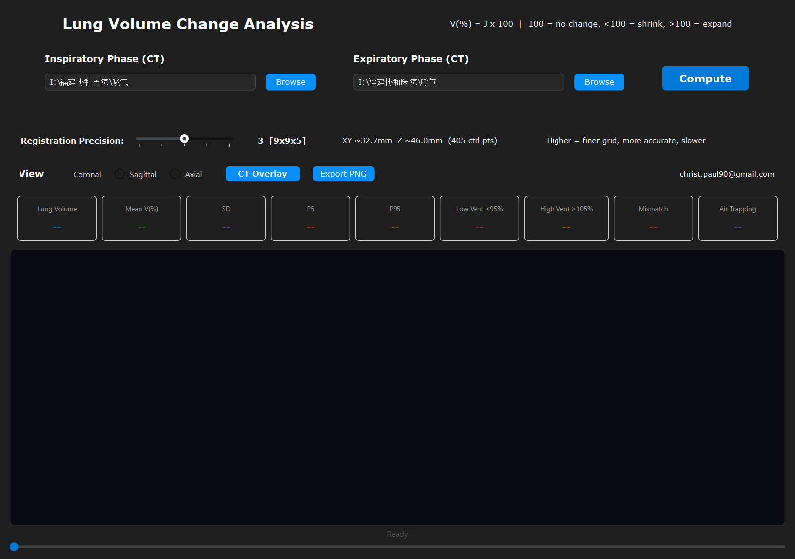
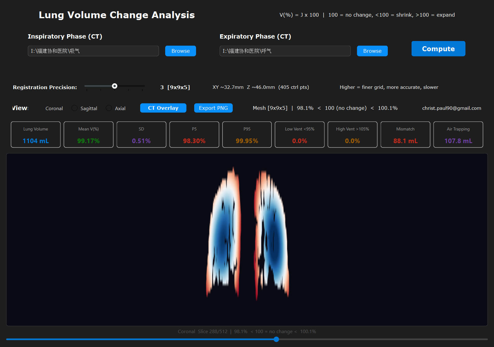
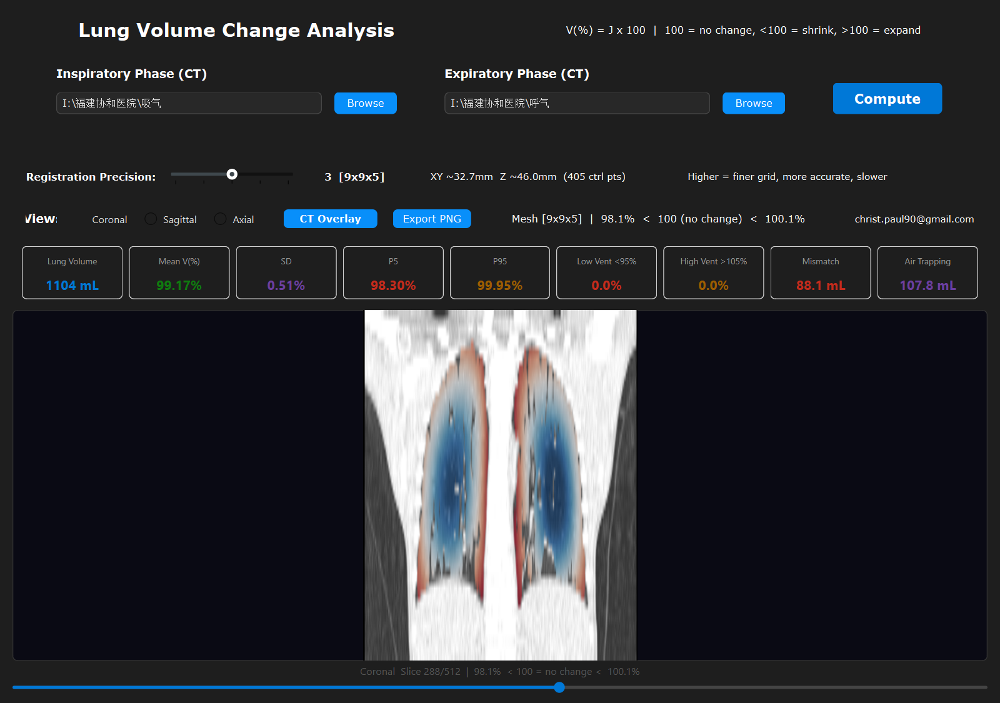
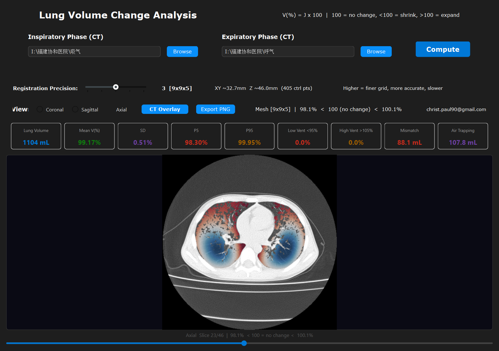
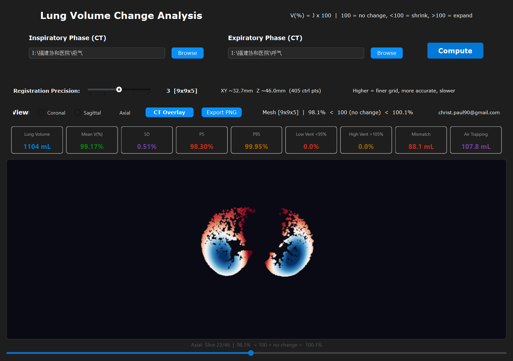
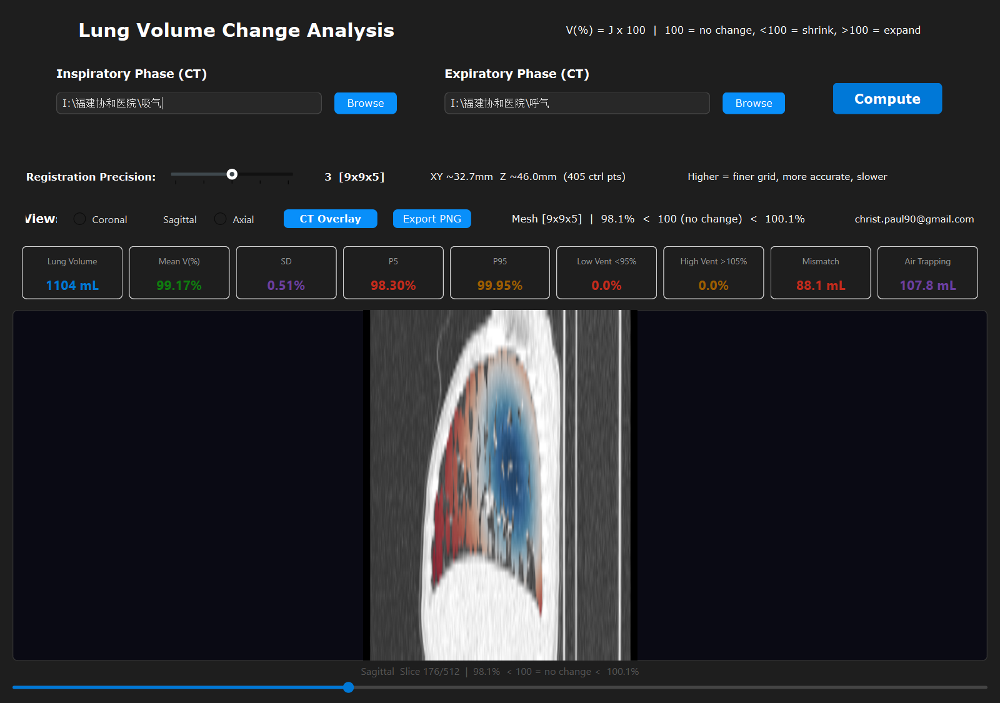

# Lung Volume Change Heatmap — COPD CT Simulation

A desktop tool for **regional lung-function analysis from dual-phase chest CT**.
It registers the *inspiratory* and *expiratory* CT of the same patient with a
deformable B-spline transform and renders the local volume change as a
**Jacobian-determinant heatmap** overlayed on the CT.

> **V(%) = J × 100** — 100 = no change, < 100 = regional shrink, > 100 = regional expand.

Aligned with **Shima et al., *Thorax* 2023;78(4):344–353**.

---

## Screenshots

**Main interface** (paths pre-filled with the inspiratory `吸气` and expiratory `呼气` series)



**Coronal heatmap** and **CT overlay**




**Axial** views




**Sagittal** CT overlay



---

## Demo computation (real data)

The screenshots above are produced by an actual run on a paired inspiratory /
expiratory chest CT (46 slices, 5.0 mm slice thickness, 0.574 × 0.574 mm
in-plane, 512 × 512) with the default registration precision `3 [9×9×5]`:

| Metric | Value |
|---|---|
| Lung volume (inspiratory) | **1104 mL** |
| Mean V(%) | **99.17 %** |
| SD | 0.51 % |
| P5 | 98.30 % |
| P95 | 99.95 % |
| Low ventilation (< 95 %) | 0.0 % |
| High ventilation (> 105 %) | 0.0 % |
| Mismatch volume | **88.1 mL** |
| Air trapping volume | **107.8 mL** |

---

## Pipeline

1. **Load** the inspiratory and expiratory DICOM series (SimpleITK series reader, validated for matching PatientID / slice count / slice thickness).
2. **Segment** lung parenchyma by HU threshold (−1000 … −400), morphological opening, hole filling and connected-component selection.
3. **Register** the expiratory volume to the inspiratory volume with a B-spline transform (multi-resolution MSE, lung mask as fixed mask).
4. **Compute** the displacement-field Jacobian determinant → `V(%) = J × 100`.
5. **Quantify** air trapping / ventilation mismatch from the warped expiratory HU.
6. **Summarise** statistics (mean, SD, percentiles, low/high ventilation percentage, mismatch and air-trapping volumes).

---

## Installation

```bash
# Python 3.9–3.13 (tested on 3.11)
pip install -r requirements.txt
```

Dependencies: `PySide6`, [`PyCt6`](https://github.com/Dliammc/CustomPyQt) (themed widget layer),
`SimpleITK`, `pydicom`, `numpy`, `matplotlib`.

## Usage

```bash
python app_pyct6.py
```

or double-click `launch.bat`.

1. Select the **Inspiratory** and **Expiratory** DICOM directories (Browse).
2. Choose a **Registration Precision** (1 = coarse/fast … 5 = fine/slow).
3. Click **Compute** and inspect the heatmap; switch between **Coronal / Sagittal / Axial**.
4. Toggle **CT Overlay** to blend the heatmap onto the CT, and **Export PNG** to save the current slice.

## Build a standalone executable

```bash
# Windows
build_exe.bat        # -> dist/LungVolumeChange.exe
```

> To build in CI instead, add a GitHub Actions workflow that runs
> `pip install -r requirements.txt` followed by the same `pyinstaller`
> command found in `build_exe.bat`.

---

## Project structure

```
.
├── app_pyct6.py            # main application (GUI + registration pipeline)
├── logo.png                # application logo / icon
├── requirements.txt
├── launch.bat              # development launcher
├── build_exe.bat           # PyInstaller build (Windows EXE)
├── screenshots/            # README figures (from a real computation)
└── LICENSE
```

---

## Notes

* **No patient data is included in this repository.** The `吸气/` and `呼气/`
  directories are ignored by `.gitignore`.
* Requires a paired inspiratory/expiratory CT of the **same patient** with the
  same geometry; the app validates this before computing.
* Registration runs on CPU and may take a few minutes for a full-resolution
  volume pair; use a lower precision level for a quick preview.

## License

MIT — see [LICENSE](LICENSE).

Developed by **christ.paul90@gmail.com**.
